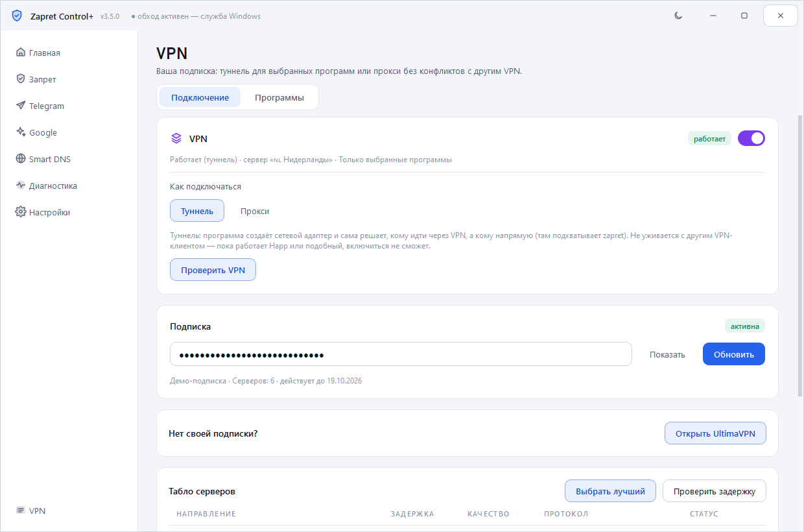
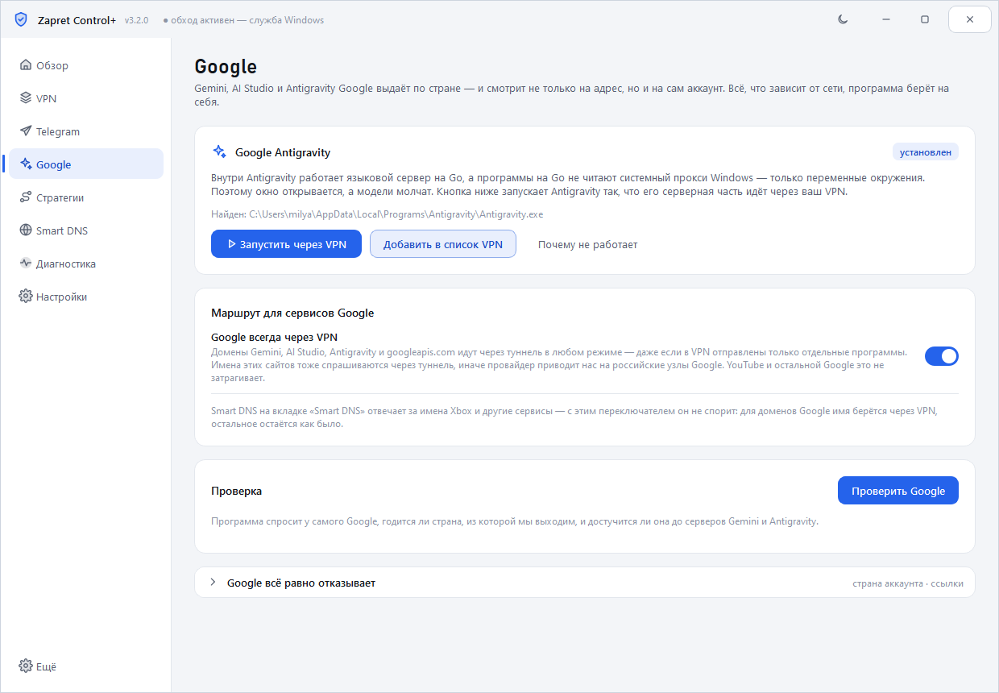

<div align="center">


[](https://github.com/77WhyNot/ZapretControlPlus/releases/latest)
[](https://github.com/77WhyNot/ZapretControlPlus/releases)
[](https://github.com/77WhyNot/ZapretControlPlus/releases/latest)
[](LICENSE)

### Обход блокировок, VPN по программам, Telegram и Smart DNS — в одном окне

Всё, что умеет [Zapret Control](https://github.com/77WhyNot/ZapretControl), плюс VPN
из вашей подписки: туннель только для выбранных программ или прокси, который
уживается с любым другим VPN-клиентом.

**[⬇ Скачать последнюю версию](https://github.com/77WhyNot/ZapretControlPlus/releases/latest)**

</div>

<div align="center">

</div>

---

## Четыре переключателя

| | |
|---|---|
| **Обход DPI** | zapret: ломает распознавание домена у провайдера. Сайты, YouTube, Discord — сразу для всей системы, скорость не падает. 22 стратегии, автоподбор. |
| **VPN** | Ваша подписка (VLESS, Reality, VMess, Trojan, Shadowsocks, Hysteria2, а также Xray-формат). Два способа подключения — см. ниже. Табло серверов с задержкой, «Выбрать лучший», переключение на лету, проверка «каким адресом меня видят». |
| **Telegram** | Прокси через WebSocket внутри программы (ядро [tg-ws-proxy](https://github.com/Flowseal/tg-ws-proxy)) и второй способ — секции zapret по подсетям Telegram. |
| **Smart DNS** | Xbox Live, Game Pass, ошибка 0x80a40401, ChatGPT, Twitch. Адреса [xbox-dns.ru](https://xbox-dns.ru/), Comss, Cloudflare, AdGuard, Google. Исходные настройки возвращаются одной кнопкой. |
| **Google** | Gemini, AI Studio и Antigravity: домены Google идут через VPN всегда, имена — тоже через туннель, а Antigravity запускается так, чтобы его языковой сервер не ходил мимо прокси. Проверка скажет, принимает ли Google страну выхода. |

Плюс **замер скорости** прямо в программе: кнопка «Замерить скорость» на главной
меряет загрузку, отдачу, задержку и разброс — тем же путём, которым сейчас идёт
трафик, так что видно настоящую скорость через VPN или обход, а не «скорость
тарифа».

<div align="center">


</div>

## Два способа подключить VPN

**Туннель.** Программа создаёт сетевой адаптер и сама решает, кому идти через VPN,
а кому напрямую: только выбранные программы, все кроме выбранных или весь трафик.
Всё, что идёт напрямую, подхватывает zapret — обход и VPN дополняют друг друга.
Адреса серверов подписки автоматически заносятся в исключения zapret, иначе он
порезал бы трафик до самого VPN-сервера. Туннель не уживается с другим
работающим VPN-клиентом: пока поднят Happ, Hiddify, WireGuard и подобные,
программа честно скажет об этом и не станет ничего ломать.

**Прокси.** sing-box слушает только на вашем компьютере, а Windows направляют туда
системный прокси. Ни адаптера, ни маршрутов, ни перехвата DNS — режим работает
рядом с любым другим VPN. Через VPN идут браузеры, Discord и всё, что уважает
системный прокси; выбор программ в этом режиме не действует. Исходные настройки
прокси возвращаются при выключении, а после падения — при следующем запуске.

## Gemini, AI Studio и Antigravity

<div align="center">

</div>

Сервисы Google отказывают по двум разным причинам, и вкладка **Google** честно
их разделяет.

**Что зависит от сети — программа делает сама.** Домены Gemini, AI Studio,
Antigravity и `googleapis.com` уходят в туннель в любом режиме, даже если в VPN
отправлены только отдельные программы. Имена этих сайтов спрашиваются тоже через
туннель, иначе провайдерский резолвер приводит на российские узлы Google. YouTube
и остальной Google это не затрагивает.

**Antigravity — отдельная история.** Внутри него работает языковой сервер на Go,
а программы на Go не читают системный прокси Windows — только переменные
окружения. Поэтому в режиме «Прокси» окно открывается, а модели молчат. Кнопка
**«Запустить через VPN»** поднимает Antigravity с нужными переменными, а
**«Добавить в список VPN»** вносит в раздельный туннель все три его процесса
(`Antigravity.exe`, `language_server.exe`, `agy.exe`) — сам по себе
`Antigravity.exe` в списке бесполезен, к моделям ходит не он.

**Чего сеть не решает.** Если Google отвечает `your current account is not
eligible … not available in your location`, дело не в адресе, а в стране самого
аккаунта Google — её задаёт платёжный профиль. Кнопка **«Почему не работает»**
читает журнал Antigravity и говорит прямо, что именно мешает: сеть или аккаунт.

## Чужой VPN программа не трогает. Никогда

Ни адаптер, ни процесс, ни службу другого клиента. Программа убирает только
своё: свой процесс движка (по пути к файлу) и свой адаптер (по имени), и только
если они остались от прошлого запуска. Установщик снимает тоже только свой
`sing-box.exe`.

Если после старых версий 2.x у вас не поднимался VPN-клиент — «Диагностика» →
**«Починить сетевые адаптеры»** включит обратно то, что они выключали.

## Установка

1. Скачайте `ZapretControlPlus-Setup-x.y.z.exe` со страницы [Releases](https://github.com/77WhyNot/ZapretControlPlus/releases/latest).
2. Запустите и нажмите «Установить». Поверх старой версии установщик предложит обновить — настройки и подписка останутся.
3. Ядро zapret и движок VPN уже внутри — доскачивать ничего не нужно.

Программа просит права администратора: WinDivert грузит драйвер режима ядра,
служба zapret создаётся в системе, а туннель VPN поднимает сетевой адаптер.

### Первый запуск VPN

Вкладка **VPN** → вставьте ссылку-подписку → **Обновить**. Ссылка хранится только
на этом компьютере. Если своей подписки нет, на этой же вкладке есть кнопка с
рекомендацией — сервис сторонний, к программе отношения не имеет.

Выберите сервер на табло (или «Выбрать лучший»), способ подключения и включите
переключатель. Кнопка **«Проверить VPN»** покажет, каким адресом и из какой страны
вас видят снаружи — через сам туннель, а не мимо него.

Для туннеля список программ — в «Ещё» → **Программы VPN** (кнопка «Программы» на
вкладке VPN). Правила применяются сами через пару секунд после правки: сколько бы
программ вы ни отметили подряд, туннель перезапустится один раз и уже со всеми
новыми правилами. Если выбран режим «Только выбранные», а не отмечено ничего,
программа скажет об этом прямо — в таком виде через VPN не пошло бы ничего.

## Чем отличается от [Zapret Control](https://github.com/77WhyNot/ZapretControl)

Обычная версия — без VPN, весит 24 МБ и не требует подписки. Plus добавляет VPN
и раздельный туннель. Если VPN не нужен, берите обычную.

## Как это работает

```
   программы
       │
       ├── напрямую ──────────────> интернет
       │        └─ здесь работает zapret (winws + WinDivert)
       │
       ├── выбранные ── TUN ── sing-box ──> VPN-сервер ──> интернет   (туннель)
       │                          ▲  адреса серверов — в исключениях zapret
       │
       └── системный прокси ── sing-box ──> VPN-сервер ──> интернет   (прокси)

Telegram Desktop ──> 127.0.0.1:1443 (MTProto-прокси внутри программы)
                         └──WebSocket/TLS──> серверы Telegram
```

## Сборка из исходников

Нужны Windows 10/11 x64, Python 3.10+ и [Inno Setup 6](https://jrsoftware.org/isdl.php).

```bash
pip install -r requirements.txt
```

```bash
powershell -ExecutionPolicy Bypass -File build\build.ps1
```

Скрипт сам скачает sing-box, нарисует иконку, прогонит проверки, соберёт
`dist\ZapretControlPlus\` и упакует установщик.

### Структура

```
app/core/       ядро: стратегии, winws, служба, Smart DNS, Telegram, обновления, диагностика
app/core/vpn/   VPN: разбор подписки, конфиг sing-box, маршруты, стыковка с zapret
app/vendor/     tg-ws-proxy — ядро прокси Telegram (MIT, без изменений)
app/ui/         интерфейс: темы, схема маршрутов, страницы
payload/zapret/ ядро zapret
payload/singbox/ движок VPN (скачивается при сборке)
```

## Автор

**ketamine** (Ivan Milyaev) — [github.com/77WhyNot](https://github.com/77WhyNot)

## Благодарности

- [bol-van/zapret](https://github.com/bol-van/zapret) — технология обхода и `winws`.
- [Flowseal/zapret-discord-youtube](https://github.com/Flowseal/zapret-discord-youtube) — стратегии и списки.
- [SagerNet/sing-box](https://github.com/SagerNet/sing-box) — движок VPN.
- [Flowseal/tg-ws-proxy](https://github.com/Flowseal/tg-ws-proxy) — прокси Telegram через WebSocket.
- [basil00/Divert](https://github.com/basil00/Divert) — драйвер WinDivert.
- [xbox-dns.ru](https://xbox-dns.ru/) — Smart DNS для гео-ограничений.

## Лицензия

Программа распространяется по [собственной лицензии](LICENSE): пользоваться и
делиться с друзьями можно свободно, а публиковать форки, изменённые версии и
брать код в свои проекты — **только с письменного разрешения автора**.

Сторонние компоненты остаются под своими лицензиями, sing-box — под GPL-3.0.
Подробности в [THIRD-PARTY-NOTICES.md](THIRD-PARTY-NOTICES.md).
