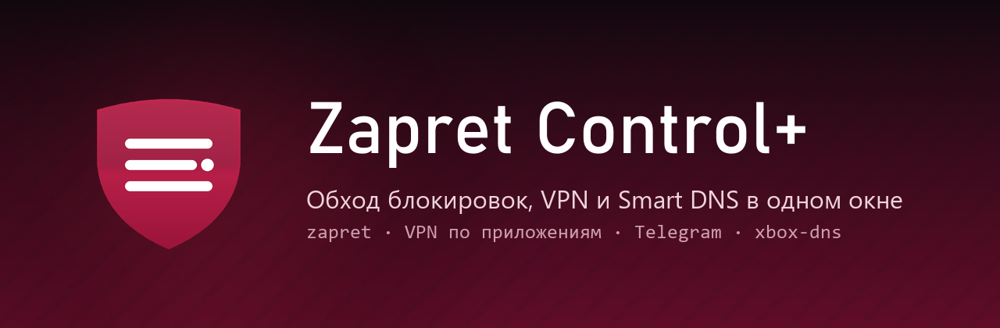
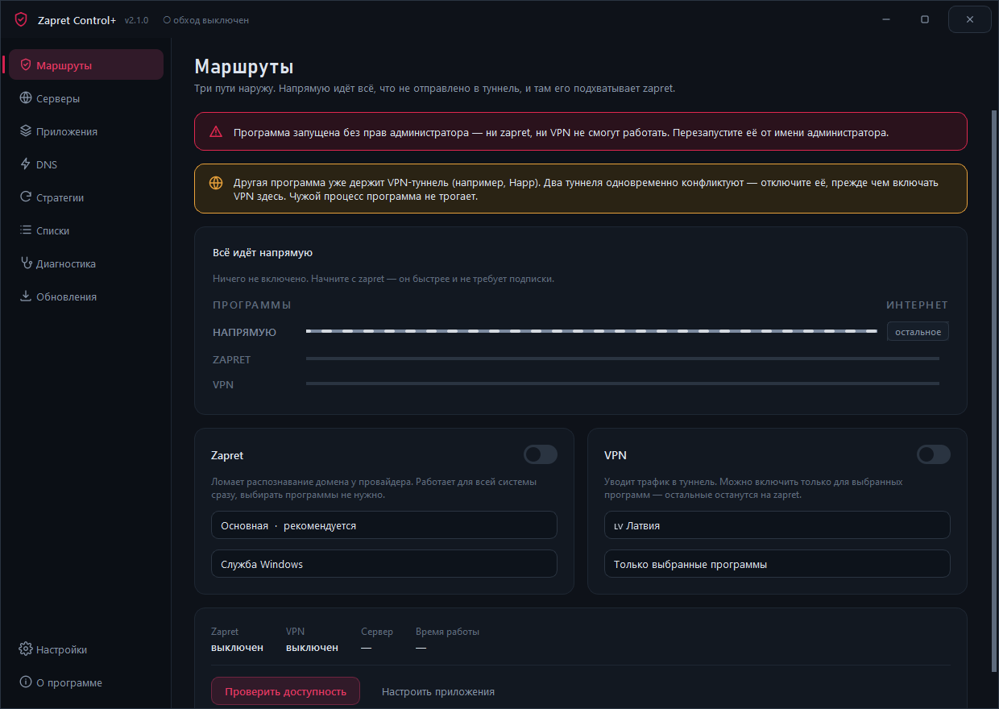
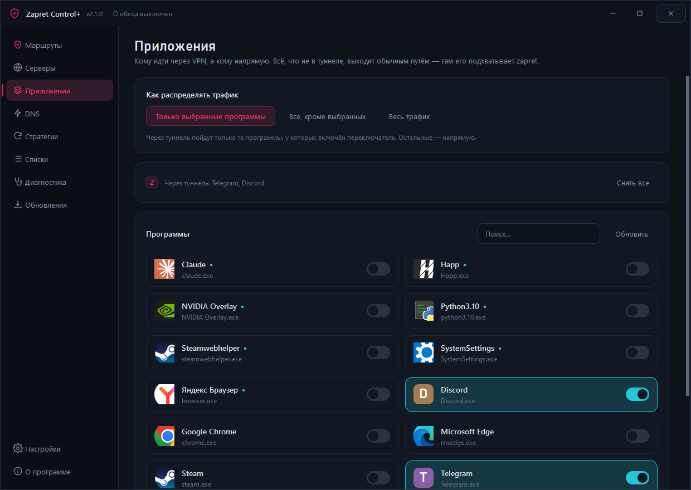
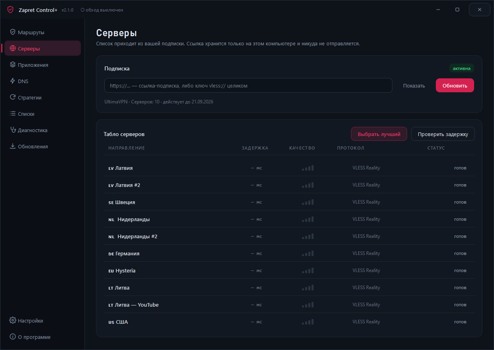

<div align="center">



[](https://github.com/77WhyNot/ZapretControlPlus/releases/latest)
[](https://github.com/77WhyNot/ZapretControlPlus/releases)
[](https://github.com/77WhyNot/ZapretControlPlus/releases/latest)
[](LICENSE)

### Обход блокировок, VPN и Smart DNS — в одном окне

zapret ломает распознавание домена у провайдера. VPN уводит в туннель только те
программы, которые вы выберете. Smart DNS возвращает Xbox Live и сервисы, режущие
доступ по стране. Всё это одновременно и без конфликтов.

**[⬇ Скачать последнюю версию](https://github.com/77WhyNot/ZapretControlPlus/releases/latest)**

</div>

<div align="center">

</div>

---

## Главная идея

Обычно эти три инструмента живут по отдельности и мешают друг другу. Zapret
Control+ сводит их в одну схему маршрутов: видно, что идёт напрямую, что через
zapret, а что в туннель — и это же и есть настройка.

Самое важное происходит незаметно: трафик до самого VPN-сервера уходит через
обычный адаптер на порт 443, и zapret его ломает — туннель просто не поднимается.
Программа сама заносит адреса серверов вашей подписки в исключения zapret,
поэтому обход и VPN работают вместе.

## Что умеет

| | |
|---|---|
| **VPN по программам** | Туннель только для выбранных программ. Остальные идут напрямую, где их подхватывает zapret. Или наоборот: всё через VPN, кроме банка и игр. |
| **Своя подписка** | Вставьте ссылку — программа сама разберёт список серверов. VLESS (в том числе Reality), VMess, Trojan, Shadowsocks, Hysteria2. Видно остаток трафика и дату окончания. |
| **Табло серверов** | Задержка до каждого сервера, качество связи, протокол. Кнопка «Выбрать лучший». Переключение на лету, без перезапуска туннеля. |
| **Обход Telegram** | MTProto не содержит имени домена, поэтому обход работает по официальному списку подсетей Telegram. Три режима на выбор. |
| **Smart DNS** | Xbox DNS (ошибка 0x80a40401, Game Pass, ChatGPT, Twitch), Comss, Cloudflare, AdGuard, Google. Исходные настройки сохраняются и возвращаются одной кнопкой. |
| **21 стратегия zapret** | Читаются напрямую из файлов ядра, автоподбор рабочей перебором, обновление из GitHub. |
| **Диагностика и инструменты** | 16 проверок: драйвер, службы, конфликты с другими обходчиками, чужие туннели, DNS, hosts. У большинства проблем есть кнопка «Исправить». Плюс перезапуск Discord с очисткой кэша и сброс кэша DNS. |
| **Закрыть чужой VPN** | Находит запущенные Happ, Hiddify, NekoRay, Clash, Outline, AmneziaVPN, WireGuard и другие клиенты и закрывает их вместе со службами — два туннеля одновременно не работают. |

<div align="center">


</div>

## Установка

1. Скачайте `ZapretControlPlus-Setup-x.y.z.exe` со страницы [Releases](https://github.com/77WhyNot/ZapretControlPlus/releases/latest).
2. Запустите и нажмите «Установить».
3. Всё. Ядро zapret и движок VPN уже внутри — доскачивать ничего не нужно.

Программа просит права администратора: WinDivert грузит драйвер режима ядра,
служба zapret создаётся в системе, а VPN поднимает сетевой адаптер.

### Настройка VPN

Вкладка **Серверы** → вставьте ссылку-подписку → **Обновить**. Ссылка хранится
только на вашем компьютере.

Дальше вкладка **Приложения**: включите переключатель у тех программ, которым
нужен туннель. Остальные останутся на zapret.

## Важно про другие VPN-клиенты

Если у вас уже запущен Happ, NekoBox, Hiddify или другой клиент с туннелем —
отключите его. Два туннеля одновременно конфликтуют. Программа это заметит и
предупредит, а чужой процесс трогать не станет.

## Чем отличается от [Zapret Control](https://github.com/77WhyNot/ZapretControl)

Обычная версия — только zapret, весит 23 МБ и не требует подписки. Plus добавляет
VPN, раздельный туннель, Telegram и DNS. Если VPN не нужен, берите обычную.

## Как это работает

```
   программы
       │
       ├── напрямую ──────────────> интернет
       │        └─ здесь работает zapret (winws + WinDivert)
       │
       └── выбранные ── TUN ── sing-box ──> VPN-сервер ──> интернет
                                    ▲
                        адреса серверов занесены
                        в исключения zapret
```

## Сборка из исходников

Нужны Windows 10/11 x64, Python 3.10+ и [Inno Setup 6](https://jrsoftware.org/isdl.php).

```bash
pip install -r requirements.txt
```

```bash
powershell -ExecutionPolicy Bypass -File build\build.ps1
```

### Структура

```
app/core/       разбор стратегий, запуск winws, служба, обновления, диагностика
app/core/vpn/   движок VPN: разбор подписки, конфиг sing-box, маршруты, стыковка с zapret
app/ui/         интерфейс: темы, схема маршрутов, страницы
payload/zapret/ ядро zapret
payload/singbox/ движок VPN
```

## Автор

**ketamine** (Ivan Milyaev) — [github.com/77WhyNot](https://github.com/77WhyNot)

## Благодарности

- [bol-van/zapret](https://github.com/bol-van/zapret) — технология обхода и `winws`.
- [Flowseal/zapret-discord-youtube](https://github.com/Flowseal/zapret-discord-youtube) — стратегии и списки.
- [SagerNet/sing-box](https://github.com/SagerNet/sing-box) — движок VPN.
- [basil00/Divert](https://github.com/basil00/Divert) — драйвер WinDivert.
- [xbox-dns.ru](https://xbox-dns.ru/) — Smart DNS для гео-ограничений.

## Лицензия

Программа распространяется по [собственной лицензии](LICENSE): пользоваться и
делиться с друзьями можно свободно, а публиковать форки, изменённые версии и
брать код в свои проекты — **только с письменного разрешения автора**.

Сторонние компоненты остаются под своими лицензиями, sing-box — под GPL-3.0.
Подробности в [THIRD-PARTY-NOTICES.md](THIRD-PARTY-NOTICES.md).
